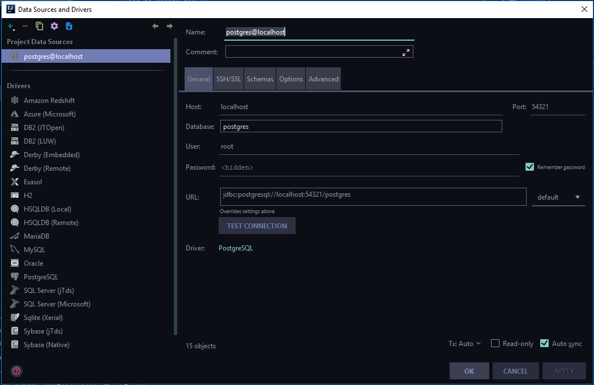

# Database Setup
Vagrant is used as a way of setting up our Database in this assignment. This was necessary because it would allow all of us to have the same database setup regardless of our computer. According to the [Hashicorp documentation](https://www.vagrantup.com/intro/index.html) Vagrant is as follows:
> Vagrant is a tool for building and managing virtual machine environments in a single workflow. With an easy-to-use workflow and focus on automation, Vagrant lowers development environment setup time, increases production parity, and makes the "works on my machine" excuse a relic of the past.

We used Boydan's [i-vagrant](https://github.com/bogdanvlviv/i-vagrant) which has a bunch of scripts to speed up development.
## How To Run
Firstly, ensure that you have the newest version of Vagrant and Virtualbox installed on your computer. Then open a command prompt in this directory, and run `vagrant up`. The virtual machine will spin up - this can take around 20 minutes on the first iteration as it needs to download and instal the virtual image. 

If that completes with no errors the server should be running. To verify this, go to IntelliJ and go: **View -> Tools Window -> Databases**

From there, click the **+** icon, select **Data Source** and use **Postgresql** as the type. Then ensure it looks as follows:

## Method Followed
We used a basic Vagrantfile, which creates an Ubuntu virtual machine with Postgresql installed on it - it creates a user and a database and then forwards the connection to port `54321`. 